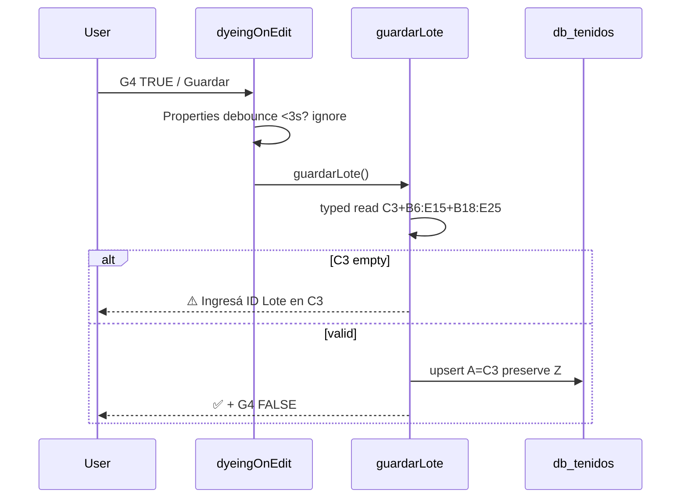
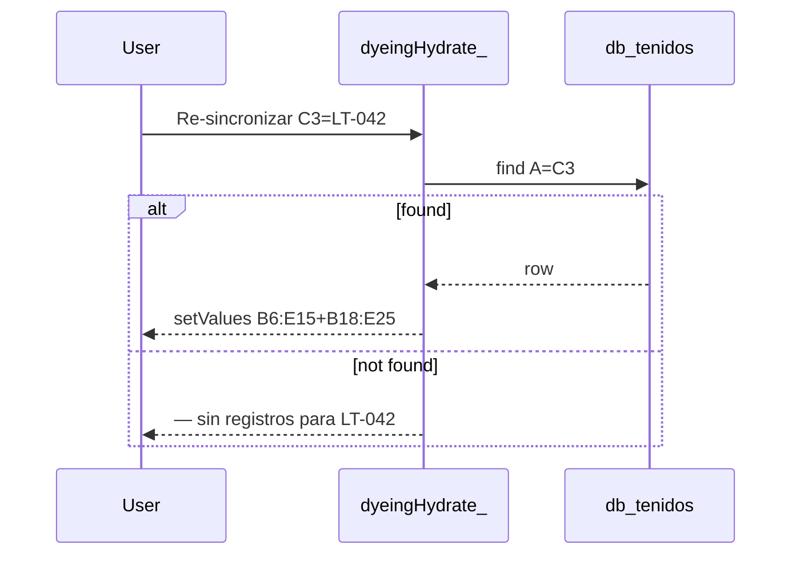

# Design: Dyeing (Teñido) — Single-Lot Persistence

## Technical Approach

Isolated V8 `apps-script/dyeing/` with `DYEING_CONFIG` SSOT: `tenidos B1:I25` (`C3` PK, `B6:E15` Teñido + `B18:E25` Muestra, `G4` checkbox) → `db_tenidos A:AD` (30 cols 25+5 audit, PK `Nº Lote`). Explicit save (`Teñido → Guardar` + `G4 FALSE→TRUE` via installable `dyeingOnEdit` → `guardarLote()`, debounce 3000ms `PropertiesService`) does typed batch capture (`getValue` for `H/S:V` NUMBER, `getDisplayValue` rest STRING) then idempotent upsert `A=C3` under `LockService.getDocumentLock()` 5s+retry. `Re-sincronizar` hydrates `B6:E15`+`B18:E25` for `C3`. Two-times fill via full `B:Y` overwrite; `creado` preserved. `America/La_Paz` only for audit `Z/AA/AB`. Input-only, no formulas, never `items`.

## Architecture Decisions

| Decision | Alternatives | Rationale |
|---|---|---|
| `DYEING_CONFIG` frozen SSOT | Inline A1s | Prevents drift/header reorder; matches `coneras`/`yarn-inventory`; no `getRange` outside Config. |
| Explicit save + `G4` reset `FALSE` ~1s | Per-cell `onEdit` | One row: batch avoids 20+ locks/partials; user closes lot; 3s `PropertiesService` debounce survives `clearContent`. |
| Typed `getValue()` `H/S:V` NUMBER rest `getDisplayValue()` STRING | All-string | Keeps `QUERY`/`SUM` on `H/S:V`; preserves `E12 "@ 24/1"` verbatim; dates `C6/C18` passthrough `dd/mm/yyyy`. |
| Upsert `A=C3` full `B:Y` overwrite, `void` soft-delete | Field delta | Day1 `O:Y=""` valid, Day3 `Re-sincronizar`+fill Muestra merges; all-empty→`void`, refill→`active`. |
| Isolated project own `appsscript.json` | Extend yarn-settings | V8 concatenation isolation; own `onOpen`/`dyeingOnEdit`. |
| Spanish verbatim, `La_Paz` only audit | UTC normalize | Dates passthrough; audit `Utilities.formatDate(...La_Paz...)` correct (UTC-4 no DST). |

## Config Structure

```js
const DYEING_CONFIG = Object.freeze({
  TIMEZONE:'America/La_Paz',
  SHEETS:{ TENIDOS:'tenidos', DB:'db_tenidos', ITEMS:'items', ERRORS:'Errors' },
  RANGES:{ PK:'C3', CHECKBOX:'G4', LABEL:'H4', TENIDO:'B6:E15', MUESTRA:'B18:E25', DB_HEADERS:'A1:AD1' },
  DB_HEADERS:['Nº Lote','Color','Código','tipo colorante','Titulo m/g','Material','Linea','T(ºC)','Tina','Nº Ingreso','Cliente','Fecha Teñido','Sup.','Turno','Secado 1','Secado 2','Revisión','Fecha Muestreo','Titulo 1','Titulo 2','Torsión 1','Torsión 2','C.C.','Turno','Observación','creado','actualizado','editado_por','estado','rango_origen'],
  LIMITS:{ COLS:30 }, UI:{ DEBOUNCE_MS:3000 }
});
```

Helpers: `dyeingGetSheet_(ss,key)`, `dyeingHeadersMatch_()`, `dyeingEnsureSchema_()` (creates `db_tenidos A:AD` protected + `G4` `FALSE/TRUE` validation, reset `FALSE`).

## Modules

| File | Responsibility |
|---|---|
| `Config.gs` | SSOT + helpers + `ensureSchema` |
| `Ingest.gs` | Batch snapshot `C3`+`B6:E15`+`B18:E25` (`H/S:V` `getValue`, rest `getDisplayValue`) |
| `Core.gs` | `guardarLote()` (guard `C3`, lock 5s+retry, upsert preserve `Z`), `dyeingHydrate_()` |
| `Persistence.gs` | `Map<A,row>` plan; `setValues`/`appendRow`; `H/S:V` format `0.00`; `void` |
| `Menu.gs` | `onOpen()` `Guardar|Re-sincronizar`; `dyeingOnEdit(e)` debounce + `guardarLote()`→`G4=FALSE` |
| `Errors.gs` | `dyeingLogError_()` → `Errors` `La_Paz` + `Session` email |
| `Setup.gs` | `dyeingSetup()` installs `dyeingOnEdit` trigger + validates `A:AD` |

## Data Flow

```
tenidos C3/B6:E15/B18:E25 ─┬─ onOpen → menu + G4 ensure
                          ├─ G4 TRUE/Guardar → dyeingOnEdit → guardarLote() → typed read → guard C3 → Lock → Map A→row → upsert A:AD → toast ✅
                          └─ Re-sincronizar → hydrate A=C3 → setValues B6:E15+B18:E25
```

## Sequence Diagrams

### Guardar



### Re-sincronizar



## File Changes

| File | Action | Description |
|------|--------|-------------|
| `apps-script/dyeing/Config.gs` | Create | `DYEING_CONFIG` + helpers |
| `apps-script/dyeing/Core.gs` | Create | `guardarLote()`, `dyeingHydrate_()` |
| `apps-script/dyeing/Ingest.gs` | Create | Typed batch snapshot |
| `apps-script/dyeing/Persistence.gs` | Create | Map upsert, `void` |
| `apps-script/dyeing/Menu.gs` | Create | `onOpen`, `dyeingOnEdit` debounce |
| `apps-script/dyeing/Errors.gs` | Create | Log to `Errors` |
| `apps-script/dyeing/Setup.gs` | Create | Trigger install + header validate |
| `apps-script/dyeing/appsscript.json` | Create | `timeZone: America/La_Paz` V8 |
| `apps-script/dyeing/tests/dyeing.test.gs` | Create | `Logger` harness |

## Interfaces / Contracts

- Public `guardarLote():{ok}`, `dyeingHydrate_():n`, `onOpen()`, `dyeingOnEdit(e)`, `dyeingSetup()`.
- PK `A=trim(C3)` STRING; `A:AD` frozen; `H/S:V` NUMBER rest STRING; `E` keeps `"@ …"`.
- Writable `C3`, `B6:E15`, `B18:E25`, `Z:AD`; never `G4`, `items`, formulas.
- Lock `tryLock(5000)→sleep 1000→tryLock(5000)`; debounce `PropertiesService` `dyeing-last-save-ms`.
- Identity `Session.getActiveUser()||unknown`; audit `Utilities.formatDate(...La_Paz...)`; dates passthrough.
- Two-times fill: full `B:Y` overwrite; `Re-sincronizar` before stage-2.

## Testing Strategy

| Layer | What | Approach |
|-------|------|----------|
| Unit | Trim `C3`, typed `H/S:V` vs `@`, debounce, `creado` preserve | Pure helpers `Logger` |
| Integration | 1-row upsert, dup no-dup, partial, `G4` double-tap, lock retry, `void→active` | COPY seeded `db_tenidos`; assert `A:AD` |
| E2E | Menu+`G4`, `Re-sincronizar` found/missing/empty, `H/S:V` NUMBER | Auth walkthrough COPY only |

## Threat Matrix

N/A — no routing, shell, subprocess, VCS/PR automation, executable-file classification, or process-integration boundary.

## Migration / Rollout

COPY only: create `tenidos`/`db_tenidos` `A:AD`+`items`+`Errors`; `dyeingSetup()` once (scopes, install `dyeingOnEdit`), reload menu; verify `G4`. Rollback: `deleteTrigger(dyeingOnEdit)`, remove project, keep `db_tenidos`.

## Open Questions

- [ ] Verify `G4`+`H4 ☑ GUARDAR` no clash with drawing.
- [ ] `items` size may shift width but never persistence.

