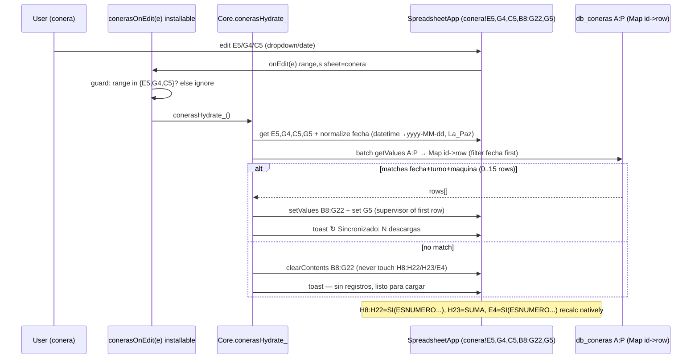
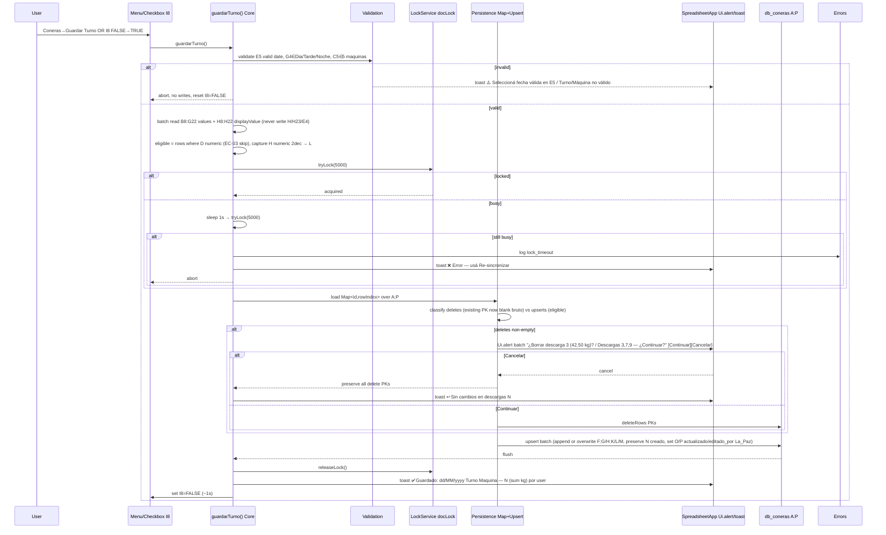

# Design: Coneras Production

## Technical Approach

Create an isolated V8 Apps Script project under `apps-script/coneras-production/` — no shared globals, triggers, or `Config` with `attendance-control`, `yarn-production`, or `yarn-settings`. All geometry, names, and locale are centralized in `Config.gs`. The form sheet `conera` is a reusable parametrized write target (`E5`/`G4`/`C5`) backed by `db_coneras` (A:P); `dashboard` aggregates exclusively via native `QUERY` (`E7` spill) with no Apps Script write path. The sole write path is an explicit batch guarded by one `LockService.getDocumentLock()`.

## Architecture Decisions

| Decision | Alternatives | Rationale |
|---|---|---|
| Centralize ALL constants in `Config.gs` (SHEETS, RANGES, HEADERS, TIMEZONE, LIMITS, ERRORS, verbatim formulas) | Inline A1s/headers per module | Single source of truth prevents drift and formula-range violations; mirrors yarn-settings/yarn-production. |
| Separate bound project vs extending attendance | Reuse attendance `onEdit`/`Config` | Avoids V8 file-concatenation collisions; each project has own `onOpen`/`onEdit` identity. |
| Hydrate filter `fecha` first, then `turno`+`maquina` | Filter all predicates together | PRD FR-001: optimizes for mobile date-first scan; date normalization (`yyyy-MM-dd` in `America/La_Paz`) avoids datetime drift. |
| Capture `peso_neto` from `H8:H22` `displayValue` | Recompute `bruto-(usos*canilla+tacho)` in Script | `H` formula `=SI(ESNUMERO(D8),MAX(0,D8-(E8*F8)-G8),"")` is source of truth (includes `MAX(0,…)`); Script only validates numeric and persists. |
| Batch `Map<id,row>` upsert under one lock (5 s + one retry) | Per-row lock / per-cell `onEdit` | One critical section for 0–15 rows; preserves idempotency, reduces quota, avoids partials. |
| Explicit save (menu + `I8` checkbox `FALSE→TRUE` → auto-reset `FALSE` ~1 s) | Auto-save on `B8:G22` edits | PRD Non-Goal: variable 0–15 rows; batch semantics prevent 15 lock acquisitions. |
| Native `QUERY` in `dashboard!E7`; single delete-guard `Ui.alert` for batch | `SUMAR.SI`/Script aggregation; per-row alert | Decouples aggregation from form geometry; one alert listing `Nº` preserves UX for multi-delete. |
| `es-BO` verbatim formulas via `valueRenderOption=FORMULA` | English formulas / `setValue` | Spreadsheet locale is `es-BO`; `SI`/`ESNUMERO`/`MAX`/`SUMA`/`QUERY` must survive locale. |

## Config Structure (single source of truth)

```js
const CONERAS_CONFIG = Object.freeze({
  TIMEZONE: 'America/La_Paz',
  SHEETS: Object.freeze({
    CONERA: 'conera',
    DASHBOARD: 'dashboard',
    DB: 'db_coneras',
    ERRORS: 'Errors'
  }),
  RANGES: Object.freeze({
    FECHA: 'E5',              // dd/MM/yyyy DATE dataValidation
    TURNO: 'G4',              // Dia|Tarde|Noche
    MAQUINA: 'C5',            // Autoconer 1/2/3, Conera 3/4
    SUPERVISOR: 'G5',
    META_MANUAL: 'C4',
    META_REAL: 'E4',          // =SI(ESNUMERO(C4),C4*dashboard!B7,"") — never written
    SAVE_CHECKBOX: 'I8',      // FALSE/TRUE checkbox
    SAVE_LABEL: 'J8',         // ☑ GUARDAR TURNO
    DASHBOARD_EFFICIENCY: 'dashboard!B7',
    FORM_B8_G22: 'B8:G22',    // only writable input zone
    FORMULA_H8_H22: 'H8:H22', // =SI(ESNUMERO(D8),MAX(0,D8-(E8*F8)-G8),"") — never written
    TOTAL_H23: 'H23',         // =SUMA(H8:H22) — never written
    FORMULA_E4: 'E4',
    NUMERO_A8_A22: 'A8:A22'   // 1..15 descarga_nro
  }),
  LIMITS: Object.freeze({ DESCARGAS: 15 }),
  TURNO_VALUES: Object.freeze(['Dia','Tarde','Noche']),
  MAQUINA_VALUES: Object.freeze(['Autoconer 1','Autoconer 2','Autoconer 3','Conera 3','Conera 4']),
  DASHBOARD: Object.freeze({
    PERIODO_VALUES: ['Fecha','Semana','Mes'],
    E7_SPILL: 'E7'
  }),
  DB_HEADERS: Object.freeze([
    'id','fecha','turno','maquina','descarga_nro','titulo','operador',
    'peso_bruto','usos','peso_canilla','peso_tacho','peso_neto',
    'supervisor','creado','actualizado','editado_por' // A:P 16 cols — frozen order
  ]),
  ERRORS_HEADER: Object.freeze(['timestamp','scope','range','code','reason','user']),
  ERRORS: Object.freeze({
    INVALID_FECHA: 'invalid_fecha',
    INVALID_TURNO: 'invalid_turno',
    INVALID_MAQUINA: 'invalid_maquina',
    EMPTY_FORM: 'empty_form',
    LOCK_TIMEOUT: 'lock_timeout',
    DELETE_CANCELLED: 'delete_cancelled'
  }),
  FORMULAS: Object.freeze({
    H8: '=SI(ESNUMERO(D8),MAX(0,D8-(E8*F8)-G8),"")', // dragged H8:H22
    H23: '=SUMA(H8:H22)',
    E4: '=SI(ESNUMERO(C4),C4*dashboard!B7,"")',
    DASHBOARD_E7: '=QUERY(db_coneras!A:P,"select F, sum(L) where B is not null and ... group by F label sum(L) \'Peso Neto\'",1)'
  })
});
```

Helpers: `conerasGetSheet_(ss, key)`, `conerasParseA1_(a1)`, `conerasNormalizeFecha_(v)` → `yyyy-MM-dd` in `America/La_Paz`, `conerasBuildId_(fecha,turno,maquina,nro)` (maquina upper no-spaces, nro zero-pad 2).

## Modules

| File | Responsibility |
|---|---|
| `Config.gs` | Frozen constants above + helpers + `conerasEnsureSchema_()` (headers A:P protected, `E5` DATE validation `dd/MM/yyyy`, `I8` checkbox `FALSE/TRUE`, `G4`/`C5` dropdowns, `B7` efficiency numeric, formulas written verbatim with `valueRenderOption=FORMULA` only during Setup). |
| `Core.gs` | Orchestration: `guardarTurno()` (validate snapshot → lock → persistence → toast), `conerasHydrate_()` (fecha-first filter), `conerasReadSnapshot_()` (batch `getValues`/`getDisplayValues` for `B8:G22` + `H8:H22` display), date/turno/maquina validation, `Utilities.formatDate` timestamps. Export: `guardarTurno`, `conerasHydrate_`, `conerasNormalizeFecha_`. |
| `Persistence.gs` | `Map<id,rowIndex>` index over `db_coneras!A:P` body (batch `getValues` once). Upsert plan: new rows → `append`; existing → overwrite `F:G/H:K/L/M/O/P` preserving `N` (`creado`). Delete plan: collect existing PKs where `D` cleared → defer to delete-guard. Apply in one `setValues` + `deleteRows` under lock; never writes `H/H23/E4`. |
| `Ingest.gs` | Installable `conerasOnEdit(e)` router: if `e.range==I8 && TRUE→guardarTurno()+reset FALSE (~1 s)`; else if `e.range in {E5,G4,C5} && sheet==conera → conerasHydrate_()` (normalize `E5` datetime→date). Ignores `B8:H22` edits. |
| `Menu.gs` | `onOpen()` → `Coneras → Guardar Turno | Ver db_coneras | Re-sincronizar`; `menuGuardarTurno()`→`guardarTurno()`, `menuVerDb()`→activate `db_coneras`, `menuResincronizar()`→`conerasHydrate_()`. Also wires `I8` checkbox creation on install. |
| `Errors.gs` | `conerasLogError_(code, reason, range)` → append to `Errors` with `timestamp` (`America/La_Paz`), `Session.getActiveUser().getEmail()||unknown`; `Logger.log` + toast mapping (`⚠️` validation, `❌ Error — usá Re-sincronizar` on lock). |
| `Setup.gs` | One-time `conerasSetup()` → `conerasEnsureSchema_()` + install installable trigger `conerasOnEdit` + `onOpen` menu. Verifies `A:P` header order frozen, `A1:H2` banner, `H8:H22`/`H23`/`E4` formulas untouched. Never runs against prod — COPY only. |

## Data Flow

```text
E5/G4/C5 onEdit (installable) ─▶ conerasOnEdit(e) ─▶ conerasHydrate_()
                                         │
  batch getValues B8:G22 + display H8:H22 │
  filter db_coneras Map by fecha(yyyy-MM-dd) → turno → maquina
  match → setValues B8:G22 + G5 (supervisor)
  no match → clearContents B8:G22 (H/H23/E4 untouched, recalc ""/0)
  toast ↻ Sincronizado / — sin registros
```

```text
I8 TRUE / Coneras→Guardar Turno ─▶ guardarTurno()
  conerasReadSnapshot_() → validate E5/G4/C5 (toast ⚠️, abort on invalid)
  capture H8:H22 displayValue → numeric filter ("" → skip row; EC-03)
  map id=fecha-turno-maquina-nro (A8:A22 1..15) → 0..15 eligible rows
  delete candidates = existing PK ∩ cleared bruto
  tryLock(5000) → sleep 1s → tryLock(5000) → fail? log Errors + toast ❌, abort
  build Map<id,row> → upsert plan + delete plan
  delete plan non-empty → Ui.alert("¿Borrar descargas N?") Continue/Cancel batch
    Cancel → preserve rows, toast ↩️ Sin cambios
    Continue → execute deletes + upserts (preserve creado, refresh actualizado/editado_por)
  toast ✅ Guardado: dd/MM/yyyy Turno Maquina — N descargas (sum kg) por user
  reset I8=FALSE (~1s via Utilities.sleep + setValue)
```

## Sequence Diagrams

### Hydrate — `E5`/`G4`/`C5` change → populate `B8:G22`



### Save — `I8` checkbox / menu → batch upsert with `LockService` + delete guard



## Interfaces / Contracts

- Public: `guardarTurno(): void`, `onOpen(): void`, `conerasOnEdit(e): void`, `menuVerDb()`, `menuResincronizar()`, `conerasSetup()`.
- PK `db_coneras`: `(fecha, turno, maquina, descarga_nro)` → `id = yyyy-MM-dd-TURNO-MAQUINANORM- NN` (upper, no spaces, zero-pad 2). Columns A:P frozen: `id,fecha,turno,maquina,descarga_nro,titulo,operador,peso_bruto,usos,peso_canilla,peso_tacho,peso_neto,supervisor,creado,actualizado,editado_por`. `fecha` is Sheets `DATE` (normalized from `E5` `dd/MM/yyyy`); `turno` STRING.
- Writable: `C4,G4,C5,E5,G5,B8:G22,I8`. Never written: `E4,H8:H22,H23` (formulas), `H23` never persisted, `L` is capture of `H` value.
- Lock: `tryLock(5000)` → `Utilities.sleep(1000)` → `tryLock(5000)`; on failure log `Errors` and toast guidance, zero writes.
- Identity: `Session.getActiveUser().getEmail() || Session.getEffectiveUser().getEmail() || 'unknown'` for `editado_por`; timestamps `Utilities.formatDate(new Date(), TIMEZONE, 'yyyy-MM-dd HH:mm:ss')`.
- Verbatim formulas (`valueRenderOption=FORMULA`): `H8=SI(ESNUMERO(D8),MAX(0,D8-(E8*F8)-G8),"")`, `H23=SUMA(H8:H22)`, `E4=SI(ESNUMERO(C4),C4*dashboard!B7,"")`, dashboard `E7=QUERY(db_coneras!A:P,"select F, sum(L) where B is not null and ... group by F label sum(L) 'Peso Neto'",1)`.

## Dashboard — `QUERY` Native + Periodo Logic

- `dashboard!E7` spill: `=QUERY(db_coneras!A:P,"select F, sum(L) where B is not null [and B=date'…' or B>=date'…' and B<=date'…'] [and C='…'] [and D='…'] [and M='…'] group by F label sum(L) 'Peso Neto'",1)`. Predicates omitted when filter=`Todos`. No Script writes dashboard.
- Periodo semantics (all dates `America/La_Paz` via `TODAY()`): `Fecha → B = Fecha picker` (requires valid date; blank → `where B is null` → empty spill/EC-09). `Semana → B ∈ [hoy-6, hoy]` (7-day rolling). `Mes → B ∈ [01/mm/yyyy, EOMONTH(hoy)]`. `Semana`/`Mes` ignore `Fecha` picker entirely (EC-10). Charts: primary `Peso Neto por Titulo` (bars on `E7`) always visible; secondary `Evolucion diaria` (`select B, sum(L) group by B` line) visible only `Semana`/`Mes`, hidden for `Fecha` (EC-12: `E4` invalid efficiency → `""`, no block).
- `dashboard!B7` global efficiency factor (e.g. `0.95`) editable; `E4` derivation `SI(ESNUMERO(C4),…)` handles blank/non-numeric without blocking save.

## Error Handling & Edge Cases

| Scenario | Handling |
|---|---|
| `E5` empty/invalid | Toast `⚠️ Seleccioná fecha válida en E5`, no writes (EC-01). |
| `G4`/`C5` invalid | Toast `⚠️ Turno/Máquina no válido`, no writes (EC-02). |
| `D` empty/non-numeric | Skip row, no DB row, `H=""` (EC-03); 0..15 rows normal. |
| `D` cleared on existing PK | Single batch `Ui.alert` listing `Nº` + kg; `Continuar→delete`, `Cancelar→preserve` (FR-010/EC-04). |
| `H` negative | Impossible — `MAX(0,…)` in native formula; Script validates numeric (EC-05). |
| `titulo`/`operador` empty with valid `D` | Valid row; `dashboard` shows `(sin título)` for grouping (EC-06). |
| `E5` datetime | Normalize to `yyyy-MM-dd` before PK (EC-07). |
| Re-save same `fecha+turno+maquina` | Upsert preserves `creado`, refreshes `actualizado`/`editado_por`/`supervisor` (EC-08). |
| `Periodo=Fecha` no picker / `Todos` | Empty spill / predicate omitted (EC-09/11). |

## Testing Strategy

| Layer | What | Approach |
|---|---|---|
| Unit | Fecha normalization, `buildId`, `H` capture rounding (2 dec), eligibilty skip, audit merge preserving `creado`, `Todos` predicate omission | Pure helpers in `Core/Injest` harness, manual run in Apps Script editor (`Logger` ✅/❌). |
| Integration | 0/1/15 upsert, re-save no dup, `MAX(0…)` negative guard, delete-guard Continue/Cancel batch, lock retry success/fail+`Errors`, `E5/G4/C5` invalid no-write | COPY workbook with seeded `db_coneras`; assert `A:P` before/after, `H/H23/E4` formulas unchanged, `I8` reset. |
| E2E | Menu/checkbox save, hydrate via `E5`/`G4`/`C5` (fecha-first), `Re-sincronizar` fallback, dashboard `QUERY` Fecha/Semana/Mes + chart visibility, mobile `I8` | Authenticated walkthrough on COPY only; verify displayValue 2 dec, spill `E7`, native validation rejection. Never prod. |

## Threat Matrix

N/A — no routing, shell, subprocess, VCS/PR automation, executable-file classification, or process-integration boundary.

## Migration / Rollout

Deploy to workbook COPY only. Run `conerasSetup()` once (authorizes scopes), reload for `Coneras` menu. Verify headers `A:P` frozen/protected, `H8:H22`/`H23`/`E4` formulas verbatim `es-BO`, `I8` checkbox `FALSE/TRUE`. Rollback: remove project/trigger, retain `db_coneras` for recovery.

## Open Questions

None — PRD v0.1.0 + specs are draft-frozen; `I8` auto-reset ~1 s and `dashboard!B7` factor are confirmed patterns.
